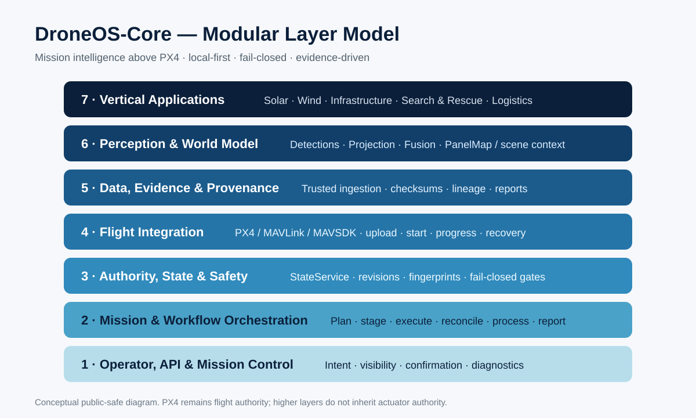

# Architecture Overview

> Updated: **6 September 2026**.

## ONEL Dynamics / DroneOS Direction
ONEL Dynamics is developing DroneOS as a reusable, local-first **mission-orchestration and evidence platform** for autonomous drone workflows. Solar inspection is the first vertical used to prove the architecture.

DroneOS is not intended to replace the flight controller. **PX4 remains flight authority.** DroneOS operates above PX4 as the mission, workflow, safety-state, data, operator and reporting layer.

The long-term architectural idea is a modular mission-intelligence Core that can coordinate increasingly rich workflows while preserving the same hard boundary: **UI and AI may propose; DroneOS validates; PX4 executes the aircraft.**



## DroneOS-Core Layer Model
DroneOS-Core is structured as responsibility layers rather than a monolithic application.

### Layer 1 — Operator / API / Mission Control
Provides human and programmatic interaction: intent, visibility, confirmation, diagnostics and read models. The UI is not source of truth; server-side authority is revalidated before commit.

### Layer 2 — Mission & Workflow Orchestration
Coordinates mission and workflow progression: planning, staging, start, reconciliation, handoff, processing, retry, cancellation and recovery semantics.

### Layer 3 — Authority / State / Safety
`StateService` and safety logic maintain live mission/workflow authority: revisions, uploaded identity, execution/handoff identity, recovery generation, dataset acceptance and fail-closed command gates.

### Layer 4 — Flight Integration
Provides the explicit PX4/MAVLink/MAVSDK boundary for mission upload/start/progress/recovery. DroneOS does not move attitude stabilization or actuator loops into Python.

### Layer 5 — Data / Evidence / Provenance
Accepts post-flight data only after identity, schema, path, telemetry and checksum validation. Provenance binds semantic artifacts such as datasets, PanelMap, proposals and reports to their exact predecessors.

### Layer 6 — Perception / World Model
Detector providers produce structured observations, not flight authority. Detections can be projected/fused into semantic world models such as `PanelMap`, which can then feed mission proposals.

### Layer 7 — Vertical Applications
Solar is the first application layer. Future domains can reuse the same mission, authority, evidence and perception primitives without rewriting the Core.

## Current Deployment Architecture

```text
┌──────────────────────────────────────────────────────────────┐
│ Operator / Mission Control                                   │
│ intent • status • workflow visibility • reports              │
└──────────────────────────┬───────────────────────────────────┘
                           │
┌──────────────────────────▼───────────────────────────────────┐
│ DroneOS Field Box — NVIDIA Jetson Orin Nano Super            │
│ orchestration • safety-state • telemetry • provenance        │
│ trusted data • analysis • diagnostics • reporting            │
└───────────────┬───────────────────────────────┬──────────────┘
                │                               │
                │ MAVLink / MAVSDK              │ physical data path
                │                               │
┌───────────────▼────────────────┐   ┌──────────▼──────────────┐
│ PX4 Flight Stack               │   │ Vehicle Agent Lite      │
│ flight authority              │   │ capture / association   │
│ stabilization • AUTO • safety │   │ finalize / transfer     │
└───────────────┬────────────────┘   └──────────┬──────────────┘
                │                               │
                └──────────────┬────────────────┘
                               ▼
                      Drone + Payload
```

## PX4 Responsibilities
PX4 owns low-level flight-control authority:

- attitude and rate stabilization
- state estimation and sensor fusion
- vehicle arming and flight modes
- AUTO mission execution
- actuator control
- core PX4 failsafes and recovery behavior

DroneOS does not run those real-time control loops.

## DroneOS Responsibilities
DroneOS owns the higher-level mission/workflow context:

- mission preparation and staging
- command safety/telemetry gating around operator actions
- mission/geofence/recovery identity tracking
- mission progress and lifecycle reconciliation
- workflow composition and progression
- trusted post-flight dataset acceptance
- analysis / semantic world-model generation
- proposal generation and operator-confirmation boundaries
- workflow provenance
- evidence/findings/report generation
- local operator visibility and diagnostics

## Field Box
The primary Field Box engineering platform is **NVIDIA Jetson Orin Nano Super**.

Validated as of September 2026:

- ARM64 runtime and native Docker build
- non-root container execution
- authenticated API and WebSocket over LAN
- local-first backend/dashboard operation
- remote connection to PX4 SITL on a separate computer
- remote PX4 mission upload/start
- live telemetry return

See [Field Box Validation](fieldbox_validation.md).

The Field Box is intended to remain useful without permanent cloud availability. Cloud services are a later extension, not a primary flight/runtime dependency.

## Vehicle Agent Lite
Vehicle Agent Lite is intentionally narrow:

- capture
- associate sensor/media with mission execution
- finalize a verifiable dataset
- transfer it to the Field Box

It should not become a second DroneOS. Mission planning, workflow authority, trusted acceptance, analysis and reporting remain on the Field Box.

The production onboard process, real camera timing and physical network path remain pending validation.

## Mission Intelligence: What Makes DroneOS “Smart”
DroneOS intelligence is not defined as “an AI model flies the drone.” The intended controlled loop is:

```text
Observe
  ↓
Understand context / world model
  ↓
Propose a mission or workflow action
  ↓
Validate live authority + safety + identity
  ↓
Execute through PX4
  ↓
Collect evidence
  ↓
Reconcile and advance workflow
```

Conceptually:

**smart = context + state + perception + rules + evidence**

AI/perception is one input to this loop, not the authority owner.

## Solar Workflow Architecture

```text
SOLAR_RECON
    ↓
PX4 execution identity
    ↓
terminal landed/disarmed handoff
    ↓
Recon dataset acceptance
    ↓
detection → projection → fusion
    ↓
PanelMap
    ↓
Inspection proposal
    ↓
operator confirmation
    ↓
SOLAR_INSPECTION
    ↓
PX4 execution identity
    ↓
Inspection dataset acceptance
    ↓
InspectionEvidence → Findings
    ↓
SolarInspectionReport
```

Solar is strategically useful because it exercises the reusable platform primitives: **discover → understand → plan → approve → execute → report**.

## Safety / Authority Design Principles
1. **PX4 remains flight authority.**
2. **Fail closed on ambiguous identity/state.**
3. **Separate workflow provenance from live mission authority.**
4. **Operator confirmation remains explicit before derived Flight B staging.**
5. **Local-first processing.**
6. **Validate in layers: tests → SITL → distributed Field Box → hardware bench → controlled physical flight.**
7. **No production claim from simulation alone.**

## Future Mission-Orchestration Center
After the physical Solar workflow is proven, the same Core can evolve into a broader orchestration center capable of combining:

- multiple mission types and sites
- richer perception/world-model providers
- event/detection-driven mission proposals
- fleet-level scheduling and supervision
- optional cloud synchronization/analytics
- additional verticals such as wind, infrastructure, agriculture, search and rescue or logistics

These are **future architectural directions**, not current commercial capabilities.

The key constraint remains unchanged: greater mission intelligence must not blur the boundary between mission authority and PX4 flight control.
