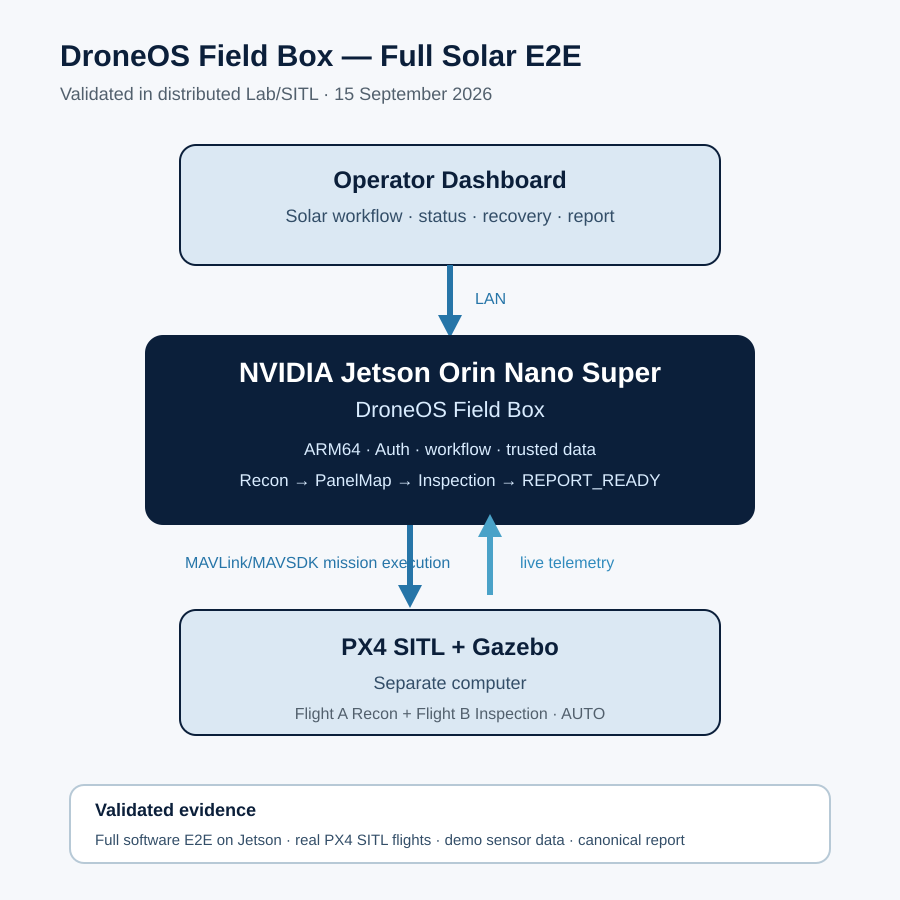

# Field Box Validation

> Public-safe validation snapshot: **6 September 2026**.

## Purpose
The DroneOS Field Box is the edge-compute node for mission orchestration, telemetry/state handling, trusted data processing, diagnostics and reporting. The current engineering platform is **NVIDIA Jetson Orin Nano Super**.

## What Was Validated
A distributed Lab/SITL architecture was demonstrated with DroneOS running on the Jetson while PX4 SITL and Gazebo ran on a separate computer.

```text
Operator browser
      │
      │ HTTP / WebSocket over LAN
      ▼
Jetson Orin Nano
DroneOS Field Box
      │
      │ MAVLink over LAN
      ▼
PX4 SITL + Gazebo
separate computer
      │
      └── live telemetry back to DroneOS
```

Validated evidence:

- native ARM64 DroneOS Docker build on Jetson
- non-root container runtime
- authenticated API access
- unauthorized API request rejected
- authorized API request accepted
- LAN dashboard/API reachability
- WebSocket connection over LAN
- remote PX4 connection
- mission upload and start through PX4Bridge/MAVSDK
- PX4 mission execution in Gazebo
- live telemetry returned to the Jetson-hosted DroneOS runtime



## What This Proves
The result demonstrates that the intended Field Box deployment boundary is technically viable in a distributed environment:

**DroneOS can run on its target ARM64 edge computer, communicate with PX4 remotely, initiate a mission through the normal PX4 mission path and receive operational telemetry back.**

This is stronger evidence than a same-machine simulator demo because it exercises the real network boundary between mission compute and flight execution.

## What This Does Not Prove
This validation is **not** physical-aircraft validation, certification or commercial readiness.

It does not yet prove:

- real flight-controller hardware behavior
- aircraft power/network reliability
- real camera timing and capture association
- RF/LTE/5G field behavior
- vibration/GPS/environmental effects
- real solar-site mapping accuracy
- thermal defect-detection performance
- regulatory or certification compliance

## Next Validation Boundary
The next evidence ladder is:

1. real Vehicle Agent Lite + camera/data transfer
2. PX4 hardware no-props bench
3. controlled physical flight
4. physical Recon capture and Field Box processing
5. physical Flight B Inspection
6. repeatable Solar pilot-quality workflow

## Public Positioning
The correct public claim is:

> **DroneOS Field Box has been validated on NVIDIA Jetson Orin Nano in a distributed Lab/SITL architecture, remotely communicating with PX4 and receiving live mission telemetry. Physical UAV validation remains pending.**
