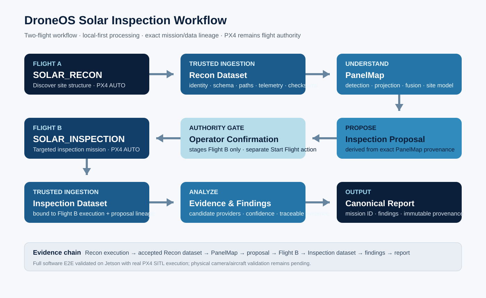

# Solar Inspection MVP

> Updated: **6 September 2026**.

Solar Inspection is the **first product vertical** used to prove DroneOS as a reusable mission-orchestration, safety-state, trusted-data and reporting platform above PX4.

The product concept is intentionally built around **two separate missions** with an authoritative post-flight processing boundary between them. The goal is not merely to fly a lawnmower route. The goal is to create a repeatable inspection workflow in which each mission, dataset, analysis result, proposal and report can be traced back to the exact execution that produced it.

PX4 remains flight authority for both flights. DroneOS owns the higher-level workflow, identity, safety gates, trusted data acceptance, orchestration and reporting.



## Product Objective

The Solar workflow exercises the core DroneOS loop:

**discover → understand → plan → approve → execute → prove**

In practical terms:

```text
Flight A — SOLAR_RECON
        ↓
landed / disarmed terminal handoff
        ↓
trusted Recon transfer + validation
        ↓
authoritative Recon dataset acceptance
        ↓
detection / projection / fusion
        ↓
PanelMap
        ↓
exact non-executable Inspection proposal
        ↓
operator confirmation bound to exact proposal fingerprint
        ↓
Flight B — SOLAR_INSPECTION
        ↓
landed / disarmed terminal handoff
        ↓
trusted Inspection transfer + validation
        ↓
InspectionEvidence
        ↓
Findings
        ↓
canonical SolarInspectionReport
```

This is deliberately different from a single monolithic autonomous flight. Flight A discovers the physical structure of the site; DroneOS converts that evidence into a semantic site model; only then can a targeted Flight B inspection mission be proposed and confirmed.

## Flight A — Recon / Mapping

### Purpose
Flight A exists to discover and structure the solar site before any targeted inspection route is executed.

### Implemented engineering path
- Solar Recon mission planning and staging
- mission identity / revision / geofence binding
- exact uploaded mission fingerprinting
- real PX4 SITL / Gazebo / MAVSDK AUTO execution
- execution-qualified mission progress observation
- terminal LAND + landed/disarmed handoff
- simulated/local Vehicle Agent Lite capture boundary
- manifest, path, telemetry and SHA-256 integrity validation
- trusted Recon dataset acceptance tied to the exact completed execution

### Why this matters
A camera file is not automatically trusted inspection evidence. DroneOS requires the dataset to match the correct mission execution and pass integrity checks before semantic processing can continue.

## Trusted Recon Ingestion

The Recon dataset does not go directly from the drone into AI.

The intended sequence is:

1. receive/copy the dataset into a temporary area
2. validate schema and finalized state
3. validate safe relative paths and reject unsafe traversal/symlink cases
4. validate mission identity, execution identity and telemetry association
5. validate checksums and dataset limits
6. reserve authoritative acceptance in StateService
7. publish the verified dataset
8. finalize acceptance
9. continue semantic processing from the accepted dataset

The design is retry-aware and idempotent: a correct retry must not blindly duplicate an already accepted transfer.

## Recon Analysis → PanelMap

The Recon stage converts raw observations into a semantic site model.

Current architecture includes:

- detector provider abstraction
- optional offline Ultralytics YOLO adapter behind the Solar detector boundary
- verified external model loading in smoke-test conditions
- image-to-ground projection support
- deterministic cross-frame fusion
- authoritative `PanelMap` generation

`PanelMap` is the bridge between **“we captured images”** and **“we understand the structure of the solar installation.”**

A 2D bounding box is not treated as a waypoint. Detections must be associated with frame context and telemetry, projected into world coordinates and fused before they can become a mission-planning input.

Current limitation: this path is still validated with deterministic/local media fixtures for the full SITL workflow. No survey-grade mapping accuracy or production detector performance is claimed yet.

## Inspection Proposal — Proposal, Not Command

DroneOS does not let perception directly command the aircraft.

From the authoritative `PanelMap`, the workflow generates an immutable, **non-executable Solar Inspection proposal**.

The proposal is bound to:

- workflow identity
- Recon acceptance
- Recon analysis result
- PanelMap provenance
- proposal fingerprint
- current mission/workflow authority

The operator confirms the **exact proposal fingerprint**. The server then revalidates authority before Flight B is staged.

This creates a critical boundary:

> **AI / analysis may propose; DroneOS validates; the operator confirms; PX4 executes.**

## Flight B — Targeted Solar Inspection

Flight B is the derived inspection mission produced from the accepted Recon result.

### Implemented engineering path
- authoritative Flight B staging
- exact proposal-to-mission lineage preservation
- real PX4 SITL / Gazebo / MAVSDK AUTO execution
- progress + terminal handoff handling
- local/simulated Inspection capture path
- accepted Inspection dataset bound to the exact Flight B execution

### Why two flights
The first mission learns the site context. The second mission uses that context to inspect deliberately. This keeps perception, planning and flight authority separated and gives the operator a review boundary before the derived mission can execute.

## Inspection Evidence → Findings → Report

After Flight B completion, the Inspection dataset follows the same evidence-driven philosophy.

The current backend can:

- validate InspectionEvidence
- bind evidence to Flight B execution identity
- generate deterministic findings through an injected candidate-provider boundary
- generate a canonical `SolarInspectionReport`
- compute deterministic report identity/fingerprint
- preserve immutable workflow/report provenance
- expose workflow state through a read-model API

The report is intended to answer not only **“what was found?”** but also **“which exact mission and dataset produced this finding?”**

## End-to-End Validation Achieved

### 1. Deterministic offline Solar E2E — validated

The software composition is validated from Recon through report using deterministic local fixtures:

**Recon → trusted acceptance → analysis → PanelMap → proposal → confirmation → Inspection → evidence → findings → report**

### 2. Real PX4 SITL A→B→Report — validated

Both Flight A and Flight B execute through real PX4 SITL / Gazebo / MAVSDK AUTO.

This validates:

- mission upload
- mission start
- PX4 AUTO execution
- mission progress observation
- terminal behavior
- A→B workflow orchestration
- report completion around real SITL mission execution

The media/detection/evidence inputs remain deterministic local fixtures in this lane.

### 3. Distributed Jetson Field Box architecture — validated

A separate September 2026 milestone demonstrated DroneOS running on **NVIDIA Jetson Orin Nano / ARM64** while PX4 SITL and Gazebo ran on another computer.

The Jetson Field Box successfully:

- exposed the authenticated DroneOS API over LAN
- accepted operator access remotely
- connected to PX4 over MAVLink LAN
- uploaded and started a remote PX4 mission
- received live mission telemetry back into DroneOS

This proves the distributed Field Box architecture used by the future physical Solar workflow. It does **not** yet prove the complete Solar A→B workflow with physical sensors or aircraft.

## Workflow Provenance

The Solar workflow preserves traceability across:

- workflow identity
- Flight A mission identity and execution
- terminal handoff
- Recon dataset acceptance
- Recon analysis result
- `PanelMap`
- Inspection proposal
- operator confirmation
- Flight B mission identity and execution
- Inspection dataset acceptance
- InspectionEvidence / findings
- canonical report fingerprint

Authority and provenance remain separate concepts:

- **StateService / safety layer:** may this operation happen now?
- **workflow provenance:** from which exact predecessor did this result originate?

The provenance ledger does not replace PX4 or live mission authority.

## Current Product Position

The Solar application is currently best described as:

> **An integrated pre-field Solar inspection engineering prototype with real PX4 SITL two-flight execution, trusted workflow/data lineage and a validated distributed Jetson Field Box architecture.**

It is **not yet a field-validated commercial Solar inspection product**.

## What Is Not Yet Claimed

- no controlled real-aircraft Solar flight validation yet
- no real onboard camera + Vehicle Agent Lite network path validated end to end
- no survey-grade PanelMap accuracy claim
- no validated production thermal-defect detector
- no validated production RGB defect-detection performance
- no autonomous obstacle-avoidance claim
- no certification or commercial-operation readiness claim

## What Remains Before a Real Solar Pilot

1. run Vehicle Agent Lite on real onboard compute
2. connect and calibrate the real camera
3. bind physical captures to exact mission execution identity
4. validate real vehicle ↔ Field Box dataset transfer
5. PX4 hardware no-props bench validation
6. first controlled physical waypoint flight
7. physical Flight A Recon
8. real Recon transfer → PanelMap
9. operator-reviewed Flight B proposal
10. physical Flight B Inspection
11. real Inspection transfer → findings → report
12. repeat the complete workflow reliably across multiple runs
13. evaluate mapping/report quality on a real solar site
14. add thermal inspection only after the physical RGB/data path is stable

## Why Solar Is the First Vertical

Solar is intentionally the first vertical because it forces DroneOS-Core to prove almost every reusable platform primitive in one concrete commercial workflow:

- mission planning
- safety and authority
- PX4 execution
- terminal handoff
- data integrity
- perception/world modeling
- operator confirmation
- derived mission generation
- evidence processing
- reporting
- provenance

If these primitives become robust in the Solar workflow, the same Core can later support additional verticals without rewriting the flight/safety architecture from scratch.

## Product Principle

The product is not **“a drone with an app.”**

The goal is a reusable software/edge layer that turns autonomous flights into controlled, traceable operational workflows:

> **DroneOS orchestrates intent, state, evidence and next-action logic. PX4 remains responsible for flying the aircraft.**
